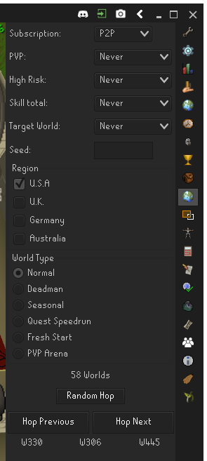

# Random Hopper
A plugin for Runelite providing easy and randomized world hopping.
# Using Random Hopper
Configure your filters using the sidebar user interface. Worlds that pass the filters are added to a randomized lists of worlds. Using the hop previous/next buttons you can go through this list of worlds to quickly and easily hop to each world in a random order. 

Additionally, you can set a seed to fix the random world order. This is a great feature for hopping worlds with groups. Instead of calling out the next world, or simply hopping down the list in order, all members can configure the same filters and seed. When configured, when every player is on the same world, "Hop Next" will go to the same world for everybody. 
# UI
